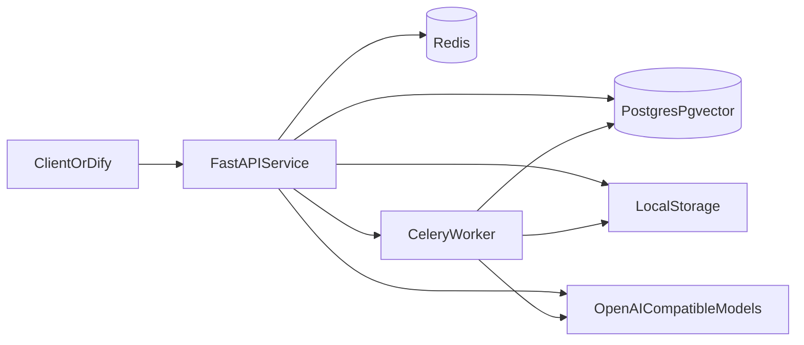

# 架构设计

## 设计目标

该服务的目标是把文档处理、向量检索和问答能力封装成一层稳定的 HTTP 后端，使其既能独立部署，也能作为 `Dify` 等平台的下游能力服务。

设计重点包括：

- 将索引链路与问答链路分离
- 通过异步任务降低上传后同步阻塞
- 用较低的部署复杂度实现可演示的 RAG 主链路
- 让上层平台只关心编排，不关心底层索引实现

## 系统组件

组件职责如下：

- `FastAPIService`
  - 提供上传、索引、检索、同步问答和流式问答接口
  - 注入 `request_id`、响应耗时和标准化错误返回
- `CeleryWorker`
  - 执行文档解析、切片、embedding 生成与向量入库
- `PostgresPgvector`
  - 保存文档元信息、索引任务和向量分片
- `Redis`
  - 作为 Celery broker/result backend，同时承载检索缓存
- `OpenAICompatibleModels`
  - 承接 chat 与 embedding 两类模型调用
- `LocalStorage`
  - 保存上传原始文件

## 关键数据流

### 文档上传与异步索引

1. 调用方上传文件到 `POST /api/v1/documents/upload`
2. API 将文件写入本地存储并创建 `documents` 记录
3. 调用方发起 `POST /api/v1/documents/index`
4. API 创建 `indexing_tasks` 记录并投递 Celery 任务
5. Worker 读取文件、解析内容、切片并生成 embedding
6. Worker 将分片与向量写入 `document_chunks`
7. 任务状态更新为 `completed` 或 `failed`

### 检索链路

1. 调用方请求 `POST /api/v1/retrieval/search`
2. API 对 query 做 embedding
3. 在 `pgvector` 中做相似度召回
4. 如启用 rerank，则做轻量关键词重排
5. 响应返回命中片段与 `meta` 信息

### 问答链路

1. 调用方请求 `POST /api/v1/chat/query` 或 `POST /api/v1/chat/stream`
2. 服务先复用检索链路拿到上下文片段
3. 依据 `max_context_characters` 控制上下文拼接长度
4. 依据 `max_answer_tokens` 控制模型输出上限
5. 返回最终答案、来源片段与调用元信息

## 与 Dify 的边界

推荐边界是：

- `Dify`
  - 负责上层工作流编排、提示词组织、结果展示
- 本服务
  - 负责文档索引、检索、RAG 问答和流式输出

这样做的好处是：

- 平台能力和后端能力边界清晰
- 本服务可脱离 Dify 单独部署和验证
- 上层平台可替换，而后端能力保持稳定

## 数据实体

当前核心实体包括：

- `documents`
  - 原始文件、索引状态、元信息
- `indexing_tasks`
  - 异步索引任务生命周期
- `document_chunks`
  - 文本分片、片段元数据、向量

详细字段可参考 `reference/database.md`。

## 当前设计取舍

- 选择 `pgvector` 而不是独立向量数据库
  - 优点是部署简单、单机演示成本低
- 选择 `Celery + Redis`
  - 优点是能快速提供稳定的异步索引能力
- 选择兼容 OpenAI 的模型接口
  - 方便接入 OpenAI、DeepSeek、DashScope、Ollama 等不同上游
- 选择本地轻量 rerank 而不是独立 reranker
  - 先在低复杂度下补足“召回后重排”的工程思路

## 当前限制

当前架构更适合单服务演示和中小规模原型，尚未覆盖：

- 多租户隔离
- 分布式对象存储
- 完整鉴权
- 独立向量检索集群
- 专业级 tracing / metrics 平台
