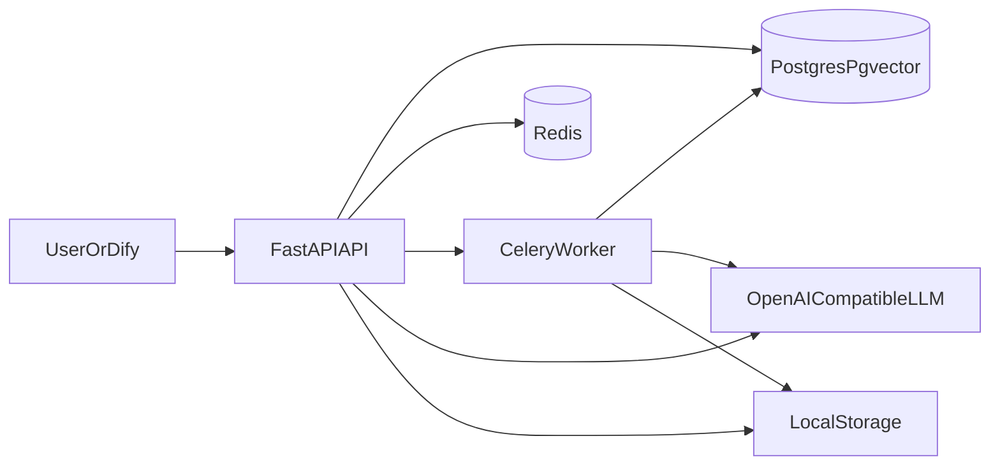

# 架构说明

## 核心目标

构建一个可被 `Dify` 调用的 `FastAPI RAG Tool Service`，把文档处理与问答能力独立成可部署服务。

## 架构图

## 数据流

### 文档上传与索引

1. 客户端上传文件到 `POST /documents/upload`
2. API 将文件写入本地存储并创建 `documents` 记录
3. 客户端调用 `POST /documents/index`
4. API 创建 `indexing_tasks` 记录并投递 `Celery` 任务
5. Worker 解析文档、切片、生成 embedding、写入 `document_chunks`
6. 任务状态更新为 `completed` 或 `failed`

### 检索与问答

1. 客户端调用 `POST /retrieval/search` 或 `POST /chat/query`
2. API 将 query 向量化
3. 在 `pgvector` 中做相似度检索
4. 将命中的上下文拼接成 prompt
5. 调用兼容 OpenAI 的模型接口返回答案

## 数据模型

- `documents`
  - 原始文件与索引状态
- `indexing_tasks`
  - 索引任务状态与执行结果
- `document_chunks`
  - 分片文本、元数据、向量

## 设计取舍

- 选择 `pgvector` 而不是独立向量库：减少部署复杂度
- 选择 `Celery + Redis`：快速提供异步任务能力
- 选择 `OpenAI-compatible API`：兼容 OpenAI、Ollama、OneAPI 等上游
